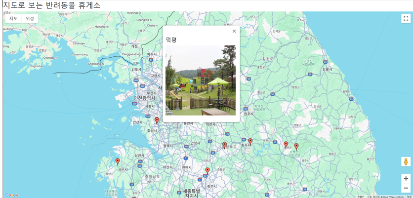

# 펫레스트 (PetRest)

**펫레스트**는 반려동물과 함께 이동할 때 전국의 반려동물 휴게소를 쉽게 찾고, 각 휴게소의 편의시설 정보를 간편하게 확인할 수 있는 웹 서비스입니다. 추석, 설 명절이나 장기 여행 시, 반려동물과 함께 이동하는 사용자들에게 최적의 정보를 제공합니다.

## 주요 기능

### 1. 휴게소 검색 및 위치 조회
- 사용자는 지역별로 전국의 반려동물 휴게소 목록을 쉽게 검색할 수 있습니다.
- 각 휴게소의 위치를 지도에서 확인하고, 관련 사진을 함께 볼 수 있습니다.

### 2. 편의시설 정보 제공
- 각 휴게소의 반려동물 친화적 편의시설 정보 제공:
  - **반려동물 놀이터**
  - **물 공급대**
  - **산책로**
  - 기타 반려동물 편의시설

### 3. 서비스 안내
펫레스트는 간단한 사용자 인터페이스를 통해 빠르게 원하는 정보를 찾을 수 있습니다.
- 특정 지역의 휴게소를 검색하고, 해당 휴게소의 사진 및 편의시설 정보를 한눈에 확인할 수 있습니다.
- 지도에서 마커를 클릭하면 휴게소 이름과 편의시설 사진이 표시됩니다.

## 기술 스택
- **프론트엔드**: HTML, CSS, JavaScript (React.js)
- **맵 서비스**: Google Maps API
- **데이터 소스**: 한국도로공사의 공공 API
